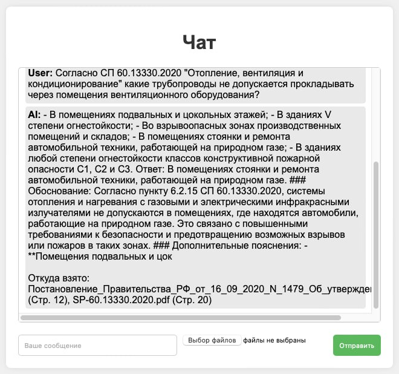

# Описание проекта

## Название проекта

Автоматизация поиска и анализа нормативной документации по строительству объектов

## Цели проекта

Основной целью проекта было создание системы, которая позволяет автоматизировать процесс поиска и анализа нормативной документации в области строительства. Система должна обеспечить эффективный доступ к нормативным документам, поддерживать поиск по тексту и таблицам, а также отвечать на сложные вопросы, связанные с нормами и стандартами.

## Задачи проекта

1. **Разработка системы поиска и анализа нормативной документации:**
   - Создать инструмент, который обеспечивает быстрый поиск по тексту, таблицам и рисункам в нормативных документах (например, СНиПы, ГОСТы).
   - Реализовать возможность загрузки различных типов документов (PDF, DOCX и т.д.) и их последующий анализ.

2. **Интеграция методов обработки естественного языка (NLP):**
   - Внедрить методы NLP для эффективного анализа текста нормативных документов и извлечения необходимой информации.

3. **Создание функции ответов на сложные вопросы:**
   - Разработать и интегрировать RAG-систему (Retrieval-Augmented Generation) для ответов на специфические вопросы по содержанию нормативных документов.

4. **Использование open-source решений:**
   - Построить систему на базе открытых программных решений для обеспечения гибкости и доступности.

## Ожидаемые результаты

- **Рабочий прототип системы, который:**
  - Обеспечивает эффективный поиск по тексту, таблицам и рисункам в нормативной документации.
  - Позволяет загружать и анализировать типовые документы.
  - Включает в себя RAG-систему, способную давать ответ на сложные вопросы по содержанию документов.

- **Повышение эффективности и точности:** 
  - Система должна упростить процесс поиска и анализа нормативных документов, сократить временные затраты и повысить качество выполнения строительных проектов.

# Реализованнное решение 

## Пример работы




## Примеры предобработки

### Предобработка страницы пдф (удаляем таблицы для парсинга OCR)


### Предобработка страницы пдф (Извлеченные таблицы)


## Технологический стек и инструменты

### Основной фреймворк

**Langchain**  
Langchain используется в качестве основного фреймворка для разработки системы обработки и анализа текстов. Он предоставляет средства для интеграции NLP-методов и построения сложных рабочих процессов с текстовыми данными.

### База данных

**ChromaDB**  
ChromaDB — векторная база данных, которая предназначена для хранения и поиска эмбеддингов текстов. Она обеспечивает эффективное индексирование и извлечение информации на основе векторных представлений данных, что критично для быстрого поиска в больших объемах текста.

### Эмбеддинги

**deepvk/USER-bge-m3**  
deepvk/USER-bge-m3 — это модель эмбеддингов, которая преобразует текст в компактные векторные представления.

### Модель

**openbmb/MiniCPM-Llama3-V-2_5**  
Эта модель предназначена для генерации ответов и обработки запросов. Она использует современные методы NLP для понимания контекста и генерации текстов, что позволяет системе эффективно отвечать на сложные вопросы, связанные с нормативной документацией.

### Предобработка

**OCR Tesseract**  
Tesseract используется для оптического распознавания символов (OCR), что позволяет извлекать текст из изображений и PDF-документов, где текст представлен в виде изображений.

**PyPDF2**  
PyPDF2 применяется для работы с PDF-документами, включая извлечение текста и метаданных, а также для объединения и разделения PDF-файлов.

**img2table**  
img2table используется для извлечения таблиц из изображений, что позволяет обрабатывать и анализировать таблицы, содержащиеся в сканированных документах.

**cv2 (OpenCV)**  
OpenCV (cv2) применяется для обработки изображений, включая улучшение качества изображений и извлечение данных из графических элементов, что необходимо для предобработки данных.

### Back-end

**Python FastAPI + Uvicorn**  
FastAPI — это фреймворк для разработки back-end части системы, обеспечивающий быстрое создание API и поддержку асинхронных операций. Uvicorn используется как ASGI-сервер для запуска FastAPI-приложения, предоставляя высокую производительность и масштабируемость.

### Front-end

**HTML, CSS, JS**  
Для front-end разработки используются стандартные веб-технологии:
- **HTML** для создания структуры веб-страниц.
- **CSS** для стилизации и оформления интерфейса.
- **JavaScript** для добавления интерактивных элементов и управления пользовательским интерфейсом.


# Установка окружения и запуск проекта

### 1. Создание виртуального окружения
Для изоляции зависимостей проекта создайте виртуальное окружение. Выполните следующие команды в терминале:

```
python -m venv venv
```

Активируйте виртуальное окружение:

- На Windows:

```
venv\Scripts\activate
```

- На macOS/Linux:

```
source venv/bin/activate
```

### 2. Установка зависимостей

Установите зависимости с помощью команды:
```
pip install -r requirements.txt
```